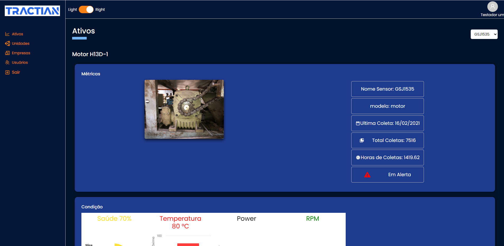
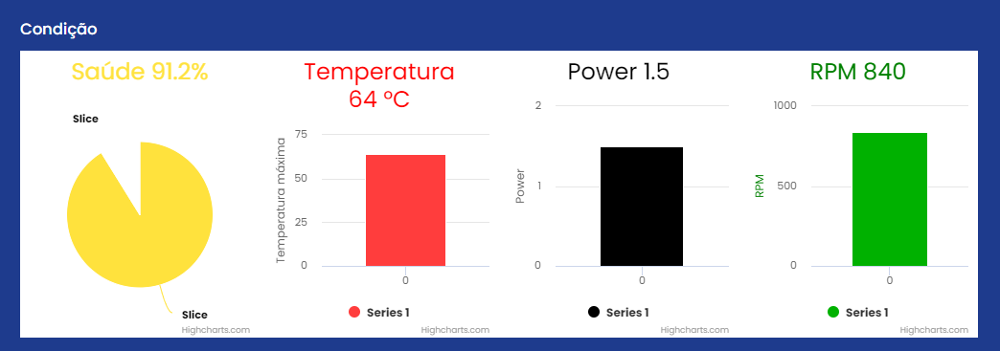

# Projeto
## _Desafio Front End Tractian_

### "Não saber não é motivo para não fazer, pelo contrário. É o primeiro passo 
### para ampliar suas habilidades" - Bruno Felix, CTO da [Tractian](https://tractian.com/)
---
## Sobre
Construir uma aplicação que mostre todos os dados e ações possíveis que utilizam a API criada no desafio back-end.

---
## Link para testar o projeto: 
https://desafiotractian.herokuapp.com/

## Imagens do projeto

---



##### Dados de acesso
Usuário
```sh
teste1@tractian.com
```
Senha
```sh
1234
```


---

## Tecnologias utilizadas
 - [React](https://reactjs.org/) 
 - [Typescript](https://www.typescriptlang.org/)
 - [Axios](https://github.com/axios/axios)
 - [React-Router-Dom](https://reactrouter.com/web/guides/quick-start)
 -  [styled-components](https://styled-components.com/)
 - [moment](https://momentjs.com/)
 -  [highcharts](https://www.highcharts.com/) 
-  [antd](https://ant.design/docs/react/introduce) 

---

## Installation

Antes de começar, certifique-se que tenha o [Node.js](https://nodejs.org/en/) instalado. Abra o terminal e digite o comando:
```sh
node -v
```
Será retornado uma informação como:
```sh
v14.16.1
```


Após clonar ou baixar esse repositório.
Entre na pasta e instale as dependências. 

```sh
cd desafioTractian-master
yarn install
ou
npm install 
```

Para rodar o projeto digite 
```sh
yarn dev
```
 Se uma página do navegador não abrir automaticamente, acesse o projeto clicando  [AQUI](http://localhost:3000/)

---
#### Adicione as credenciais de acesso.
```sh
Usuário teste1@tractian.com
Senha 1234

```

---

### Licensa
MIT
**Free Software, Yeah!**
